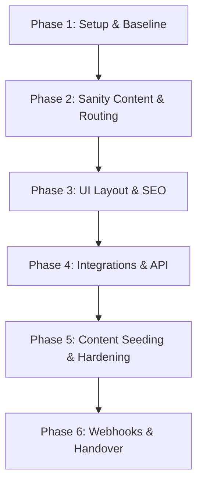

# Master Implementation Plan — Presura Website

This document outlines the Master Implementation Plan and task sequencing review for the **Presura** lead-generation website. It establishes the design layout, stack configuration, phases, task dependencies, and verification strategy under the approved AI Process Pack v1.4 workflow.

---

## Approved Decisions & Hard Boundaries

All choices from the Human Decision Review have been approved. These are the active constraints for this project:

- **WEB-DEC-006 (Lead Data Retention):** Store minimal inquiry/lead records in Supabase for **6 months**, then delete or anonymize them unless converted into an active business/customer record.
- **WEB-DEC-008 (Analytics/Privacy):** Plausible-style cookie-less/privacy-friendly analytics first. Do not add GA4, GTM, Meta Pixel, or marketing cookies unless explicitly approved later.
- **WEB-DEC-010 (Public business NAP/contact):** Use placeholders for all public business NAP/contact/schema values until final owner-approved production values are provided.
- **WEB-DEC-011 (Media/Proof Assets):** Placeholders are allowed during build, but real work photos/proof/trust assets must replace launch-critical placeholders before final launch.
- **WEB-DEC-012 (Local page content rule):** Create only **2-3 local landing pages** in the MVP, and only when each has unique local proof/value (no boilerplate-swapped duplicates).
- **WEB-DEC-013 (Pricing transparency):** Use ranges or "from" prices with clear variable caveats where pricing is shown.
- **WEB-DEC-014 (Sanity admin access posture):** Require 2FA where available, but do not block launch solely if a provider does not support 2FA. Enforce least privilege, strong passwords, no exposed write tokens, and safe token handling.
- **WEB-DEC-015 (Performance policy):** Numeric Core Web Vitals values remain implementation targets, not automatic launch blockers.

---

## Required Implementation Corrections & Constraints

### 1. Public Business Data Placeholder Rule
- Use **"Presura"** as the project/site placeholder name.
- **Do not** use "Presura d.o.o.", final phone, address, hours, email, or schema values in the public UI, metadata, JSON-LD, or documentation until final legal values are approved. All these must remain placeholders.

### 2. Package Manager and Dependency Installation Posture
- Before running `npm install` or choosing a package manager (`npm`/`pnpm`/`yarn`), inspect the repository root directory.
- If no lockfile or package manager config exists, propose a choice to the owner and wait for approval.
- **Do not** install any dependencies or run dependency-changing commands without explicit approval.

### 3. Sanity Connection & Dataset Posture
- Phase 2 may implement local Sanity schema files and local Studio configurations.
- **Do not** deploy the schema, connect production Sanity, create datasets, or use real Sanity API tokens until environmental variables and account details are explicitly approved.

### 4. Supabase Setup & Migrations Rule
- **Do not** run SQL migrations, database setup scripts, or destructive database commands without explicit approval.
- Row-Level Security (RLS) policies, service role token isolation, `retention_delete_after` triggers, and public/private key separation must be fully verified and documented before claiming PASS.

### 5. Proof Assets and Content Policy
- Use placeholders where final proof assets, real work photos, testimonials, or public business copy are not approved.
- Do not claim real proof is present unless the assets are provided and approved. Missing launch-critical proof must be marked **NEEDS HUMAN APPROVAL / NOT VERIFIED**.

### 6. Mandatory Codex Review Gates
- **Phase 4** (Forms, DB, Turnstile, and Resend integrations): Codex review is **mandatory** after this phase.
- **Phase 5** (Content Seeding & Hardening): Codex review is **recommended** before final deployment/handover if accessibility, performance, SEO, or content changes are significant.
- **Phase 6** (Deployment, Webhooks, & Handover Pack): Codex review is **mandatory** after this phase.

---

## 1. Product Understanding

- **What We Are Building:** A fast, high-conversion, SEO-ready public website for the **Presura** local technical services project.
- **Target Audience:** Homeowners and property owners in the Osijek/Bilje region in Croatia seeking heating, boiler servicing, water treatment, or heat pump installations.
- **MVP Goals:** 
  1. Catch and convert urgent mobile users needing emergency boiler/heating repairs (frictionless tap-to-call flow).
  2. Educate and capture high-consideration leads researching expensive, complex installations (heat pumps, radiator flushing) via a secure inquiry form.
  3. Provide a structured, headless CMS (Sanity) setup for editors to update content safely without code changes.

---

## 2. Approved Stack Understanding

| Component | Approved Technology | Usage in Presura MVP |
|---|---|---|
| **Frontend** | Astro | Renders static pages via SSG for perfect Core Web Vitals (LCP <= 1.5s, CLS 0). Hydrates only interactive components (Turnstile, form UI states) using the "Islands Architecture". |
| **Styling** | Tailwind CSS v4 | Provides tokenized styling with maximum efficiency, keeping CSS bundle small. Combined with CVA (Class Variance Authority) for accessible button/card states. |
| **CMS** | Sanity | Serves as the single source of truth for public content. Exposes content through the Sanity API. Schema and configuration implemented in Phase 2. No production connections or tokens deployed until approved. |
| **Leads DB** | Supabase | Used **exclusively** for inquiry/lead storage. Private leads are posted to a secure database table; public pages NEVER pull content from Supabase. No database commands executed without approval. |
| **Email** | Resend | Dispatches transactional email notifications to the company email once a lead is successfully saved in Supabase. |
| **Deployment** | Vercel | Hosts the Astro app, manages environmental variables/secrets, and executes Astro serverless API endpoints (`/api/inquiries`). Rebuilds static pages via Sanity webhooks. |
| **Anti-Spam** | Cloudflare Turnstile | Validates user interaction server-side before storing inquiries or triggering emails. Assisted by hidden honeypot fields. |
| **Analytics** | Privacy-Friendly Analytics | Track conversions and UTM traffic using a cookie-less, Plausible-style configuration. Ads/marketing scripts default to blocked. |

---

## 3. MVP Scope

- **Homepage:** Navigation hub featuring service links, problem symptom links, trust badges, and a persistent sticky call CTA on mobile.
- **Service Pages (Up to 6):** Custom landing pages explaining service benefits, prices, and related problems.
- **Problem Pages (2-3):** Symptom-focused educational pages routing to the recommended service.
- **Local Landing Pages (2-3):** Targeted location pages (e.g., Osijek, Bilje) with unique local testimonials and real-work proof.
- **Pricing & Inquiry Page:** Listing transparent pricing ranges with caveats and housing the contact form.
- **Works/Case Studies Index:** Displays real work photos and descriptions under approved publication consent.
- **Contact Page:** Holds primary click-to-call link, map location area, and contact form.
- **Astro API Endpoint (`POST /api/inquiries`):** Handles form logic, honeypot, Turnstile validation, rate limiting, Supabase storage, and Resend notifications.
- **Accessibility & SEO Baseline:** WCAG 2.2 AA compliance and correct HVACBusiness JSON-LD structure using "Presura" placeholder.

---

## 4. Out-of-Scope

- Any scheduling, calendar, shift-planning, payroll, or HR dashboard features.
- SaaS multi-tenant template logic.
- Integration with external CRMs.
- Programmatic/mass automated generation of local landing pages.
- A/B testing frameworks or custom configurators.
- GA4, GTM, Meta Pixels, or third-party cookies (unless approved post-launch).

---

## 5. P0 Launch Blockers

1. **CTA Tap-to-Call Availability:** Sticky call CTA missing, obscured, or using unapproved telephone routing.
2. **Exposed Secrets:** Write/admin keys for Sanity, Supabase service role keys, Turnstile secrets, or Resend credentials visible in client bundles.
3. **Contact Form Breakdown:** Inquiry endpoint failing to write to Supabase, sending emails without Turnstile validation, or leaking database errors.
4. **Thin Local Content:** Locations index/pages published containing cloned copy without unique local proof.
5. **No Verification Evidence:** Claiming PASS on P0 checklist without accompanying log files, Rich Results test screenshots, or accessibility test evidence.

---

## 6. Recommended Phase/Batch Plan

### Phase 1: Project Setup & Quality Baseline
- **Tasks:** TASK-001
- **Goal:** Initialize Astro, Tailwind CSS v4, linting, type-checking, quality rules, and environment placeholders. Propose package manager and verify repo emptiness.
- **Dependencies:** None
- **Files Touched:** `package.json`, `astro.config.mjs`, `tsconfig.json`, `.env.example`, `src/layouts/Layout.astro`, `docs/local-development.md`, `docs/deployment-and-env.md`
- **Env Vars Needed:** `PUBLIC_SITE_URL` (local dev fallback)
- **Commands:** `npm run build`, `npm run lint` (or package manager equivalent once approved)
- **Human Approval Gates:** Package manager approval, dependency install approval.
- **Verification Evidence:** Build command logs, `.env.example` placeholder diffs.
- **Build Note:** `/build-notes/phase-01-scaffold-astro-tailwind.md`
- **Codex Review Required?** Yes.
- **Commit/Rollback:** Commit baseline structure. Revert: soft reset to initial empty repo.

### Phase 2: Sanity Content & Routing
- **Tasks:** TASK-002, TASK-003
- **Goal:** Deploy Sanity schemas locally (Service, Problem, Location, FAQ, Work, PriceItem) and implement corresponding Astro routes.
- **Dependencies:** Phase 1
- **Files Touched:** `/sanity/schemas/`, `src/lib/sanity.ts`, `src/pages/index.astro`, `src/pages/usluge/index.astro`, `src/pages/usluge/[slug].astro`, `src/pages/problemi/index.astro`, `src/pages/problemi/[slug].astro`, `src/pages/lokacije/index.astro`, `src/pages/lokacije/[slug].astro`, `src/pages/cjenik.astro`, `src/pages/radovi/index.astro`, `/docs/cms-editor-guide.md`, `/docs/content-update-guide.md`
- **Env Vars Needed:** `PUBLIC_SANITY_PROJECT_ID`, `PUBLIC_SANITY_DATASET`, `PUBLIC_SANITY_API_VERSION` (Local only; no production tokens/deployment until approved)
- **Commands:** local Studio startup, query checks.
- **Human Approval Gates:** Sanity local schema check, route structure review.
- **Verification Evidence:** Local Sanity query logs, empty state fallback screenshots.
- **Build Note:** `/build-notes/phase-02-sanity-schemas-routes.md`
- **Codex Review Required?** Yes.
- **Commit/Rollback:** Revert router setup if schema mapping breaks page generation.

### Phase 3: UI Design System & SEO Metadata
- **Tasks:** TASK-004, TASK-005
- **Goal:** Design clean responsive components (Sticky Mobile CTA, Trust Bar, Cards, Price Anchors) and inject rich SEO elements (JSON-LD metadata, sitemap, robots using "Presura" placeholder).
- **Dependencies:** Phase 2
- **Files Touched:** `src/components/Navigation.astro`, `src/components/StickyCallCTA.astro`, `src/components/TrustBar.astro`, `src/components/ServiceCard.astro`, `src/components/SEO.astro`, `astro.config.mjs` (sitemap plugins), `/docs/seo-maintenance-guide.md`
- **Env Vars Needed:** `PUBLIC_SITE_URL`
- **Commands:** `npm run build`
- **Human Approval Gates:** Mobile sticky layout test, HVACBusiness schema schema validation.
- **Verification Evidence:** Rich Results Testing tool screenshot, keyboard focus outline checks.
- **Build Note:** `/build-notes/phase-03-ui-seo.md`
- **Codex Review Required?** No.
- **Commit/Rollback:** CSS revert if Tailwind rules clash.

### Phase 4: Integrations & API (Supabase, Resend, Turnstile, Analytics)
- **Tasks:** TASK-006, TASK-007, TASK-008, TASK-009
- **Goal:** Setup Supabase `inquiries` table with 6-month retention, write the secure `/api/inquiries` form endpoint with Turnstile check, link to Resend, and inject Plausible-style tracking.
- **Dependencies:** Phase 3
- **Files Touched:** `src/pages/api/inquiries.ts`, `src/components/InquiryForm.astro`, Supabase SQL schemas, `/docs/lead-management-guide.md`, `/docs/security-privacy-handover.md`, `/docs/deployment-and-env.md`
- **Env Vars Needed:** `SUPABASE_URL`, `SUPABASE_SERVICE_ROLE_KEY`, `RESEND_API_KEY`, `RESEND_FROM_EMAIL`, `INQUIRY_RECIPIENT_EMAIL`, `TURNSTILE_SECRET_KEY`, `PUBLIC_TURNSTILE_SITE_KEY`, `PUBLIC_ANALYTICS_DOMAIN`
- **Commands:** None without explicit approval.
- **Human Approval Gates:** DB setup/migrations approval, RLS verification, Turnstile test bypass check.
- **Verification Evidence:** Redacted API response, Supabase database table record, Resend test email receipt.
- **Build Note:** `/build-notes/phase-04-integrations.md`
- **Codex Review Required?** **Yes (Mandatory Gate).**
- **Commit/Rollback:** Disable API router endpoints or fall back to staging variables.

### Phase 5: Content Seeding & Hardening
- **Tasks:** TASK-011, TASK-012
- **Goal:** Seed 6 services, 2-3 problems, 2-3 locations with unique local proof placeholders, verify sitemaps, and run accessibility/performance audits.
- **Dependencies:** Phase 4
- **Status:** Planning phase completed. Plan generated at [phase-05-implementation-plan.md](file:///d:/Presura_v2/implementation-plans/phase-05-implementation-plan.md).
- **Files Touched/Modified:**
  - `src/sanity/seed.json` (Sandbox mock data)
  - `src/layouts/Layout.astro` (A11y landmarks, skip links, contrast, meta fallbacks)
  - `src/components/InquiryForm.astro` (A11y labels, dynamic errors, aria tags)
  - `src/components/Header.astro`, `src/components/Footer.astro`, `src/components/StickyCTA.astro` (Layout A11y, phone wrapper parameters)
  - `src/styles/global.css` (Focus-visible ring styling, skip-link visible state, reduced motion rules)
  - `src/pages/**/*.astro` (Single H1 compliance, semantic markup structure)
  - `src/pages/sitemap.xml.ts` (Dynamic exclude of unpublished/drafts and thin local landing pages)
  - `docs/*.md` (Maintenance guides, CMS workflows, content replacement guidelines)
- **Env Vars Needed:** None new (uses existing `PUBLIC_SITE_URL` for sitemap canonical tests)
- **Commands:** 
  - `pnpm run build`
  - `pnpm run preview`
- **Human Approval Gates:**
  - `NEEDS HUMAN APPROVAL`: Final public business NAP/contact values.
  - `NEEDS HUMAN APPROVAL`: Real customer testimonials, reviews, and project photos.
  - `NEEDS HUMAN APPROVAL`: Automated tool installation for Lighthouse audits.
- **Verification Evidence:**
  - `/verification/TASK-011.md` (Seeded records check, sitemap audit, no real private customer data confirmation)
  - `/verification/TASK-012.md` (Keyboard focus tests, color contrast logs, Lighthouse targets)
- **Build Note:** `/build-notes/phase-05-seed-hardening.md`
- **Codex Review Required?** Recommended before proceeding to final deployment.
- **Commit/Rollback:** Revert changes to `seed.json`, Astro layout/components, and global stylesheets.

### Phase 6: Webhooks & Handover
- **Tasks:** TASK-010, TASK-013
- **Goal:** Prepare Vercel hosting configurations, document Sanity content update webhooks, build final verification evidence register, and verify owner handover documentation.
- **Dependencies:** Phase 5
- **Status:** Planning phase completed. Plan generated at [phase-06-implementation-plan.md](file:///d:/Presura_v2/implementation-plans/phase-06-implementation-plan.md).
- **Files Touched/Modified:**
  - `verification/evidence-register.md` (Evidence tracking)
  - `docs/*.md` (All guides, owners manual, change logs, handovers)
- **Env Vars Needed:**
  - `PUBLIC_SITE_URL` (Public/Client-Safe)
  - `PUBLIC_TURNSTILE_SITE_KEY` (Public/Client-Safe)
  - `PUBLIC_ANALYTICS_DOMAIN` (Public/Client-Safe)
  - `SUPABASE_URL` (Private/Server-Only)
  - `SUPABASE_SERVICE_ROLE_KEY` (Private/Server-Only)
  - `RESEND_API_KEY` (Private/Server-Only)
  - `RESEND_FROM_EMAIL` (Private/Server-Only)
  - `INQUIRY_RECIPIENT_EMAIL` (Private/Server-Only)
  - `TURNSTILE_SECRET_KEY` (Private/Server-Only)
- **Commands:**
  - `pnpm run build`
  - `pnpm run preview`
- **Human Approval Gates:**
  - `NEEDS HUMAN APPROVAL`: Live production environment Vercel deployment.
  - `NEEDS HUMAN APPROVAL`: Live Supabase migration execution and API keys config.
  - `NEEDS HUMAN APPROVAL`: Sanity webhook dashboard creation.
  - `NEEDS HUMAN APPROVAL`: Domain DNS mappings and indexing robots configuration.
- **Verification Evidence:**
  - `/verification/TASK-010.md` (Webhook trigger schema, fallback guide, variables register)
  - `/verification/TASK-013.md` (Redacted checks log, final launch readiness checklists)
- **Build Note:** `/build-notes/phase-06-deployment-verification-handover.md`
- **Codex Review Required?** **Yes (Mandatory Gate).**
- **Commit/Rollback:** Redeploy Vercel to a previous stable preview or mock build.

---

## 7. Task Dependencies

| Task ID | Direct Dependencies | Requirements Covered | Source Blueprints / Docs | Touched Areas / Files | Requires Secrets? | Human Approval Gates? | Codex Review? |
|---|---|---|---|---|---|---|---|
| **TASK-001** | None | REQ-DEVOPS-001, REQ-TEST-001 | Intake, Roadmap, Env Spec | `package.json`, layout, baseline configs | No | Baseline & Package Manager approval | Yes |
| **TASK-002** | TASK-001 | REQ-PROD-003A, REQ-PROD-003B | CMS Spec, Data Contract | Sanity schemas & Studio setup | No | Schema approval (Local configuration only) | Yes |
| **TASK-003** | TASK-001, TASK-002 | REQ-PROD-001, REQ-PROD-002, REQ-PROD-003A | Page Blueprints, Data Contract | Pages directory, Sanity helper logic | No | Route checks | Yes |
| **TASK-004** | TASK-001, TASK-003 | REQ-PROD-001, REQ-UI-001, REQ-A11Y-001, REQ-PERF-001 | Component Spec, UX Spec | Components (Sticky CTA, trust bar) | No | Mobile UX review | No |
| **TASK-005** | TASK-003 | REQ-SEO-001, REQ-PROD-002 | SEO Spec, Page Blueprints | HTML headers, sitemaps, robots.txt | No | Rich Schema validation | No |
| **TASK-006** | TASK-001 | REQ-FORM-001, REQ-PRIV-001 | Form Spec, Security Spec | Supabase database migrations | Yes | Migrations / Setup approval | Yes |
| **TASK-007** | TASK-006 | REQ-SEC-001, REQ-FORM-001, REQ-FORM-002, REQ-PRIV-001 | Form Spec, Security Spec | `api/inquiries.ts`, Resend, Turnstile | Yes | Security review / API keys approval | Yes (Mandatory Gate) |
| **TASK-008** | TASK-004, TASK-007 | REQ-FORM-001, REQ-FORM-002, REQ-SEC-001, REQ-A11Y-001 | Component Spec, UX Spec | `InquiryForm.astro`, interactive UI states | Yes | Form submission test | Yes |
| **TASK-009** | TASK-001, TASK-003 | REQ-PRIV-001 | Security Spec, Data Contract | Analytics script injection | No | Privacy review | No |
| **TASK-010** | TASK-001, TASK-002, TASK-003, TASK-007, TASK-009 | REQ-DEVOPS-001 | Env Spec | Webhook endpoint, Vercel build configs | Yes | Production setup approval | Yes (Mandatory Gate) |
| **TASK-011** | TASK-002, TASK-003, TASK-004, TASK-005 | REQ-PROD-002, REQ-UI-001 | Content Blueprint, SEO Spec | Sanity Lake data entries, real assets | No | Proof assets approval | No |
| **TASK-012** | TASK-004, TASK-005, TASK-008, TASK-009 | REQ-A11Y-001, REQ-PERF-001 | SEO Spec, Component Spec | Speed & Accessibility optimizations | No | Audit results review | Recommended |
| **TASK-013** | TASK-001 to TASK-012 | All | Verification Plan | `/verification/`, `/docs/` | No | Transfer approval | Yes (Mandatory Gate) |

---

## 8. Tasks That Should Not Be Combined

- **TASK-002 (Sanity Schema) & TASK-006 (Supabase Table):** These must remain separate as they govern separate security and architecture silos. Sanity is for public content, while Supabase holds private leads. Combining them risks architectural contamination.
- **TASK-007 (Inquiry API) & TASK-008 (Form UI):** Developing the backend API separately ensures clean testing of validation, rate limits, and Turnstile checks before connecting to the frontend form.
- **TASK-010 (Vercel Deploy/Webhooks) & TASK-013 (Final Verification Pack):** Keeping the deployment phase isolated prevents local environment changes from corrupting the final evidence compilation.

---

## 9. Tasks That Could Be Split Smaller

- **TASK-007 (Secure API Setup):** Can be split into:
  1. *TASK-007A:* Set up Vercel/Astro endpoint with anti-spam honeypot and schema checks.
  2. *TASK-007B:* Integrate Supabase DB write.
  3. *TASK-007C:* Connect Resend email delivery.
- **TASK-003 (Astro routing):** Can be split into:
  1. *TASK-003A:* Setup index commercial paths (Home, Services, Problems, Locations).
  2. *TASK-003B:* Setup dynamic slugs resolving from Sanity with safe empty/fallback states.

---

## 10. Security & Privacy Risks

1. **Supabase Service Role Key Exposure:**
   - *Risk:* Accidental exposure of the service role key in the browser environment gives full write/delete access to database records.
   - *Mitigation:* Ensure `SUPABASE_SERVICE_ROLE_KEY` is loaded only in `.astro` server-side files or endpoint files (`.ts` routes) and never bound to client scripts. Implement RLS on the table to block public reads.
2. **Exposing API Keys in Logs:**
   - *Risk:* Writing the body of `/api/inquiries` submissions or error stacks directly to logger systems can leak customer names, phones, messages, or provider tokens.
   - *Mitigation:* Sanitize logs before printing. Log only metadata (e.g., `"Inquiry received: accepted"`), and catch Resend/Supabase exceptions without printing full configuration variables.
3. **Turnstile Secret Leak:**
   - *Risk:* Exposing the Turnstile secret key client-side allows bots to bypass verification.
   - *Mitigation:* Ensure Turnstile validation happens strictly on Vercel backend routers.
4. **Data Retention Violation:**
   - *Risk:* Retaining customer inquiries indefinitely breaches GDPR.
   - *Mitigation:* Supabase table contains the `retention_delete_after` date field. Implement a routine database clean-up process (via database CRON or documented manual deletion instructions).

---

## 11. Documentation & Handover Plan

We will create and maintain documentation in `/docs/` and `/build-notes/` according to the AI Process Pack v1.4 rules. No secrets will be written to these files.

| Document Path | Content Purpose | Created/Updated in Phase |
|---|---|---|
| **`/build-notes/phase-XX-[name].md`** | Evidence of actions, deviations, and command outputs for each build phase. | Phase 1 to 6 |
| **`/verification/evidence-register.md`** | Index of all requirement PASS evidence (Rich Schema verification, sitemaps, forms). | Phase 6 |
| **`/docs/local-development.md`** | Explains local dependencies, startup commands, and env configuration. | Phase 1 |
| **`/docs/deployment-and-env.md`** | Safe setup steps for Vercel, Sanity, Supabase, Resend, and Turnstile. | Phase 1 & 4 |
| **`/docs/cms-editor-guide.md`** | Guides editors on publishing schemas, status tags, and content blocks. | Phase 2 & 5 |
| **`/docs/lead-management-guide.md`** | Details where leads go, retention policies, and notification triggers. | Phase 4 |
| **`/docs/security-privacy-handover.md`**| Privacy policy summary, credentials audit, data classification details. | Phase 4 & 6 |
| **`/docs/owner-manual.md`** | High-level summary for the site owner on running and editing the site. | Phase 6 |
| **`/docs/troubleshooting.md`** | Recovery steps for webhook failure, API blocks, or deployment errors. | Phase 6 |

---

## 12. Missing Information

| Item | Sensitivity / Impact | Classification |
|---|---|---|
| **Production business contact data (NAP)** | High (Schema/UI blocks) | **NEEDS HUMAN APPROVAL** / **LAUNCH BLOCKER** |
| **Real work portfolio images & copy** | Medium (Trust/SEO blocks) | **NEEDS HUMAN APPROVAL** / **ASSUMPTION** |
| **Vercel team/project identifiers** | Medium (Hosting deploy) | **NOT SPECIFIED** |
| **Supabase schema/account ownership** | High (Lead database) | **NOT SPECIFIED** |
| **Resend sender address validation domain**| High (Email notifications) | **NEEDS HUMAN APPROVAL** |
| **Analytics script account domain** | Low (GDPR/Compliance check) | **NOT SPECIFIED** |

---

## 13. Recommended First Implementation Phase

We recommend executing **Phase 1: Project Setup & Quality Baseline** (TASK-001).
- **Why:** It establishes a clean, buildable Astro and Tailwind workspace. Setting up formatting, lint checks, and the `.env.example` placeholders immediately ensures code quality from day one and guards against accidental key exposure before any dynamic code is written.

---

## 14. Branch & Commit Strategy

- **Branch Naming:**
  - Standard branch name per phase: `phase-[XX]-[name]` (e.g., `phase-01-setup`).
  - Merge to `main` only after verification evidence passes and receives human approval.
- **Commit Pattern:**
  - One approved phase per checkpoint.
  - Commit messages must be structured: `[Phase-XX] [TASK-ID]: Short descriptive title` (e.g., `[Phase-01] TASK-001: setup astro project and tailwind v4 baseline`).

---

## 15. Verification Strategy

We will follow the rule: **No PASS without evidence.**
- **Automatic checks:** Run `npm run build`, `npm run lint`, and `npm run typecheck` in Phase 1-6.
- **Manual verification:**
  - Check mobile layout rendering and sticky CTA visibility in chrome devtools responsive emulator.
  - Submit test forms and copy output database rows (redacted) and Resend portal confirmation.
  - Validate JSON-LD code block outputs using schema.org validators.
- **Evidence Storage:** Captured log files and screenshots will be saved to `/verification/` with matching references in `/verification/evidence-register.md` and phase-specific build notes.
